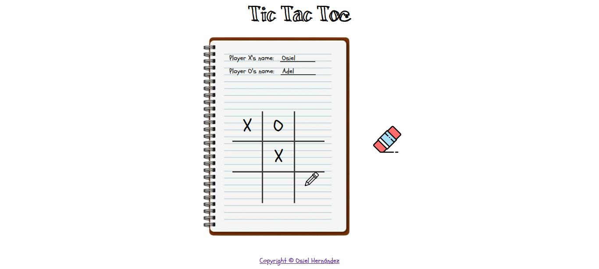

# Tic-Tac-Toe  

The Tic-Tac-Toe project is a web-based game that allows two players to compete in a classic turn-based match. The application provides a clean and intuitive interface for players to take turns, track scores, and restart games seamlessly. Enjoy playing this game with your friends and family!

## Screenshots  

## Link  

https://xxosielxx.github.io/tic-tac-toe  

## Features  

The Tic-Tac-Toe project includes the following features:  
- **Game Board**: A 3x3 grid where players place their marks (X or O).  
- **Player Turns**: Alternating turns between Player X and Player O with visual feedback.  
- **Win Detection**: Automatic detection of winning conditions (3 in a row, column, or diagonal).  
- **Reset Gameboard**: A "Reset" button to reset the board and start a new game. 

## Author  

[Osiel Hernández](https://www.github.com/xXOsielXx)